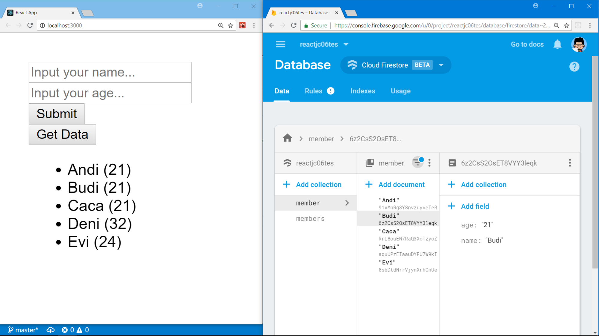

#


# __React & Firebase Cloud Firestore__

### A simple React app to post data to Firebase Cloud Firestore. 

<!-- [](https://www.youtube.com/watch?v=COcSUL76pUY) -->

## __:snowflake: Follow these instructions:__

In this project, you will have 2 textbox inputs a button to post user input into Firebase Cloud Firestore. First, create a project on [Firebase](https://firebase.google.com/), then clone this repo:

```bash
$ git clone https://github.com/LintangWisesa/React_Firebase_Cloud_Firestore.git

$ cd React_Firebase_Cloud_Firestore

$ npm install
```

Open __fire.js__ then edit it with your own Firebase snippets. Get your Firebase snippets from __*your_Firebase_project > Project Overview > Add to Web App*__. Then simply run this React project locally:

```bash
$ npm start
```

__*Note:*__ In this project, you need a global package: __*firebase-tools*__ & a local packages: __*firebase*__.

## __:snowflake: Screenshot:__



__Done!__ :thumbsup:

#

## See also:
- [React & Firebase Database](https://github.com/LintangWisesa/React_Firebase_Database)
- [React & Firebase Storage](https://github.com/LintangWisesa/React_Firebase_Storage)
- [React & Firebase Cloud Firestore](https://github.com/LintangWisesa/React_Firebase_Cloud_Firestore)

#

#### Lintang Wisesa :love_letter: _lintangwisesa@ymail.com_

[Facebook](https://www.facebook.com/lintangbagus) |
[Twitter](https://twitter.com/Lintang_Wisesa) |
[Google+](https://plus.google.com/u/0/+LintangWisesa1) |
[Youtube](https://www.youtube.com/user/lintangbagus) | 
:octocat: [GitHub](https://github.com/LintangWisesa) |
[Hackster](https://www.hackster.io/lintangwisesa)